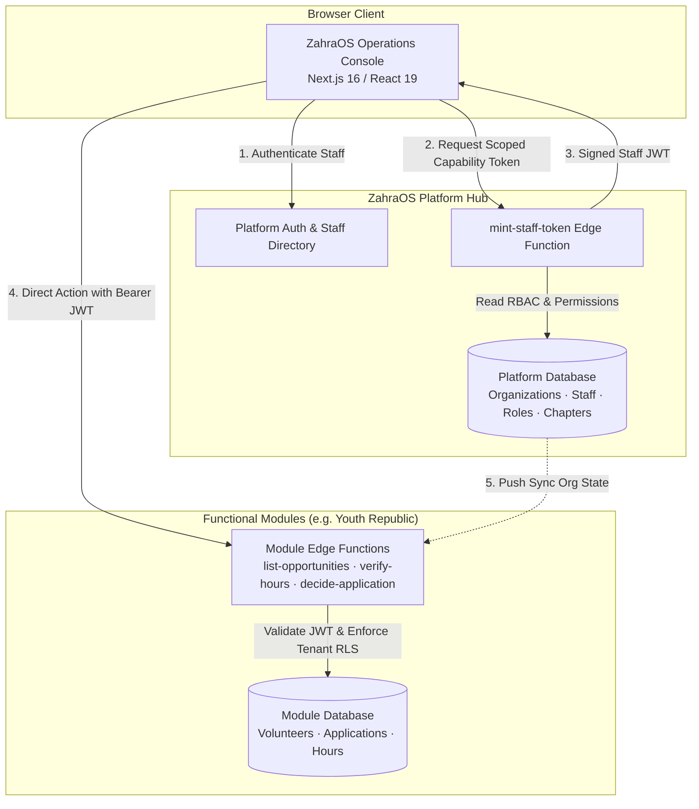

# ZahraOS

> **Enterprise Non-Profit Operating System & Administrative Command Center**  
> Developed by **The Mohsin Project Global**, ZahraOS is a multi-tenant enterprise resource management and operations platform purpose-built for accredited non-profits, humanitarian relief networks (including **Rizq** food distribution), social initiatives, and institutional partners.

[](https://nextjs.org/)
[](https://react.dev/)
[](https://supabase.com/)
[](https://deno.land/)
[](https://www.postgresql.org/)
[](https://www.typescriptlang.org/)
[](https://tailwindcss.com/)
[](https://pgtap.org/)

---

## 🌟 Executive Overview

Humanitarian relief networks and non-profit consortiums operate across complex hierarchies—spanning national headquarters, regional chapters, field teams, and external partner NGOs. Generic SaaS tools fail to provide the necessary multi-tenant isolation, rigorous auditability, fine-grained permissioning, and specialized operational workflows needed for high-stakes civic operations.

**ZahraOS** serves as the unified operational backbone:
- **Centralized Identity & Governance**: Global staff directory, custom role creation, granular permission templates, and secure credential provisioning.
- **Multi-Tenant Organization & Chapter Hierarchy**: Isolated workspaces for partner organizations with regional chapter scoping and custom brand configuration (logos, colors, metadata).
- **Asymmetric Trust & Cryptographic Minting**: A decentralized microservice architecture where ZahraOS acts as the authoritative identity provider, minting scoped capability JWTs for independent functional modules (e.g., Youth Republic).
- **High-Density Operations Command Center**: Real-time KPI dashboards, application triage queues, interactive form builders, bulk hours verification with supervisor adjustments, and KYC identity inspection.

---

## 🏗 Modular Multi-Project Architecture

ZahraOS adopts an architectural pattern designed for high scale and modular independence:
1. **Platform Layer (ZahraOS Core)** owns staff identity, organizational tenants, RBAC, module enablement, and the unified administrative console shell.
2. **Domain Modules (e.g., Youth Republic)** run in their **own dedicated Supabase projects and databases**. ZahraOS owns zero module domain data.
3. **Cryptographic Direct Access (No Bottleneck Proxies)**: The admin browser exchanges its platform session for a **minted staff capability token** (HS256 signed with a shared cluster secret). The browser communicates directly with domain module Edge Functions, ensuring wire-speed throughput without back-channel latency.
4. **Push-Based Organization Sync**: Platform tenant mutations (creations, deactivations, branding updates) are pushed to subscribed modules via idempotent sync webhooks.



---

## ✨ Core Modules & Functional Capabilities

### 1. Multi-Tenant Organization & Chapter Management
- Multi-tier scoping: National Organization $\rightarrow$ Regional Chapters $\rightarrow$ Field Drives.
- Dynamic branding configuration: Custom brand hex codes, logos, favicons, and mission statements pushed automatically to all connected modules.
- Tenant isolation enforced via PostgreSQL Row Level Security across 15+ database migrations.

### 2. Fine-Grained Role-Based Access Control (RBAC)
- Custom role builder allowing organizations to clone base archetypes (*Operations Lead*, *Drive Coordinator*, *Application Reviewer*) and compose custom permission sets.
- Capability claims emitted in minted staff tokens (`module_access`, `org_roles`, `can_verify_identity`).

### 3. Youth Republic Operations Console
Integrated directly into the ZahraOS dashboard:
- **Operations Command Center (KPIs)**: Live capacity tracking, pending decision ribbons, and volunteer throughput metrics.
- **Dynamic Application Form Builder**: Visual schema builder producing deterministic JSON schemas across 12 field types with instant "Live Volunteer Experience" preview.
- **Candidate Triage Queue**: Application review inspector supporting dynamic responses, portfolio review, and automated acceptance/waitlist status progression.
- **Hours Verification & Adjustment Engine**: Bulk verification with inline adjustment mechanisms (`hoursVerified ≠ hoursSubmitted`) and mandatory supervisor audit justifications.
- **Identity Verification (KYC) Drawer**: Restricted to personnel with elevated `can_verify_identity` clearance to inspect and adjudicate government documents before zero-retention data purge.
- **Non-Repudiation Audit Trail**: Immutable ledger recording all administrative decisions, adjustments, role delegations, and access changes.

---

## 🛠 Tech Stack

| Layer | Technologies |
|---|---|
| **Frontend Web** | Next.js 16 (App Router), React 19, TypeScript, Tailwind CSS v4, SWR |
| **Backend & Serverless** | Supabase Edge Functions (Deno runtime), Next.js Server Components / Server Actions |
| **Database & Identity** | PostgreSQL 15+, Row Level Security (RLS), custom cryptographic token minter |
| **Testing** | Vitest & React Testing Library (mocked-network contract testing), pgTAP (PostgreSQL RLS suite), Deno test runner |
| **Tooling & Lints** | ESLint 9, TypeScript 5, Supabase CLI |

---

## 📁 Repository Structure

```text
zahraos/ (tmp-partner-admin/)
├── app/                          # Next.js 16 App Router
│   ├── login/ & set-password/    # Secure staff authentication and credential lifecycle
│   ├── organization/             # Tenant workspace settings and branding editor
│   ├── organizations/            # Multi-org directory and tenant provisioning
│   ├── team/                     # Active team directory, invites, and seat deactivation
│   ├── youth-republic/           # Operations console for Youth Republic module
│   │   ├── dashboard/            # Operations command center & KPI metrics
│   │   ├── applications/         # Candidate triage and dynamic form response viewer
│   │   ├── drives/               # Opportunity pipeline and visual form builder
│   │   ├── hours/                # Hours verification and supervisor adjustment console
│   │   └── volunteers/           # Volunteer directory and identity verification drawer
│   ├── globals.css               # Design system styling & Tailwind v4 theme
│   └── layout.tsx                # AppShell container and tenant selector
├── components/                   # Modular UI components
│   ├── forms/                    # Form builder and input components
│   └── shell/                    # Navigation, tenant context provider, and user menu
├── lib/                          # Core utilities & API clients
│   ├── forms.ts                  # Pure dynamic form validator (shared contract)
│   ├── youthRepublicFunctions.ts # Typed client for Youth Republic Edge Functions
│   ├── platformFunctions.ts      # Typed client for ZahraOS platform functions
│   └── supabase/                 # Supabase SSR browser & server clients
├── registry/                     # Pluggable module registry
├── supabase/                     # Platform database & Edge Functions
│   ├── config.toml               # Supabase CLI configuration
│   ├── functions/                # Deno Edge Functions
│   │   ├── _shared/              # Shared JWT signing and security helpers
│   │   ├── assign-staff-org-role/
│   │   ├── create-chapter/
│   │   ├── create-custom-role/
│   │   ├── create-organization/
│   │   ├── deactivate-staff/
│   │   ├── enable-module/
│   │   ├── invite-staff-member/
│   │   ├── mint-staff-token/     # Cryptographic staff capability JWT generator
│   │   ├── update-organization/  # Org update + push sync to modules
│   │   └── update-staff-access/
│   ├── migrations/               # 15 PostgreSQL schema & RLS migrations
│   └── tests/                    # pgTAP database tests & Edge function unit tests
├── tests/                        # Vitest suites for components, forms, and pages
└── README.md
```

---

## 🧪 Testing & Quality Assurance

ZahraOS maintains end-to-end reliability through a multi-tier test strategy:

1. **Database Isolation & RLS (`pgTAP`)**:
   - Every permission gate, tenant boundary, and chapter filter is validated against PostgreSQL directly:
   ```bash
   for f in supabase/tests/database/*.sql; do
     psql "$SUPABASE_DB_URL" -v ON_ERROR_STOP=1 -f "$f"
   done
   ```

2. **Edge Function Unit Tests (`Deno`)**:
   - Token minting, role assignment, and organization sync tests:
   ```bash
   cd supabase && deno task test
   ```

3. **Frontend Component & Integration Suite (`Vitest`)**:
   - Tests form builders, triage flows, and permission-gated controls:
   ```bash
   npm test
   ```

---

## 🚀 Local Development Setup

### Prerequisites
- Node.js 20+ & npm
- Deno 1.40+
- Supabase CLI (`npm install -g supabase`)
- PostgreSQL Client (`psql`)

### 1. Platform Backend Setup
```bash
# Copy and configure environment variables
cp .env.example .env

# Source variables and link Supabase project
set -a; source .env; set +a
npx supabase link --project-ref "$SUPABASE_PROJECT_REF"

# Apply all platform migrations
npx supabase db push --linked

# Run pgTAP database tests
for f in supabase/tests/database/*.sql; do
  psql "$SUPABASE_DB_URL" -v ON_ERROR_STOP=1 -f "$f"
done
```

### 2. Frontend Console Setup
```bash
# Install dependencies
npm install

# Configure local client environment
cp .env.local.example .env.local
# Set NEXT_PUBLIC_SUPABASE_URL and NEXT_PUBLIC_SUPABASE_ANON_KEY

# Run test suite
npm test

# Launch development server
npm run dev
```

Navigate to [http://localhost:3000](http://localhost:3000) to access the ZahraOS command center.

---

## 🔐 Security & Governance Architecture

- **Zero Direct Table Access**: Administrative screens interact with domain data strictly through Edge Functions verified by cryptographically signed capability tokens.
- **Asymmetric Trust Boundary**: Module databases never share service keys with the platform; authorization is delegated strictly via short-lived capability JWTs.
- **Audit Non-Repudiation**: Modifying sensitive volunteer, hour, or organizational records emits immutable audit entries with actor metadata and timestamps.
- **Strict Role Isolation**: Identity verification documents can only be unlocked by staff holding the explicit `can_verify_identity` clearance claim.

---

## 📜 Legal & Operating Entity

ZahraOS is developed and maintained by **The Mohsin Project Global (SMC) Pvt. Ltd** (Corporate Unique Identification No. 0352616).  
Contact: `support@themohsinproject.org` | `legal@themohsinproject.org`